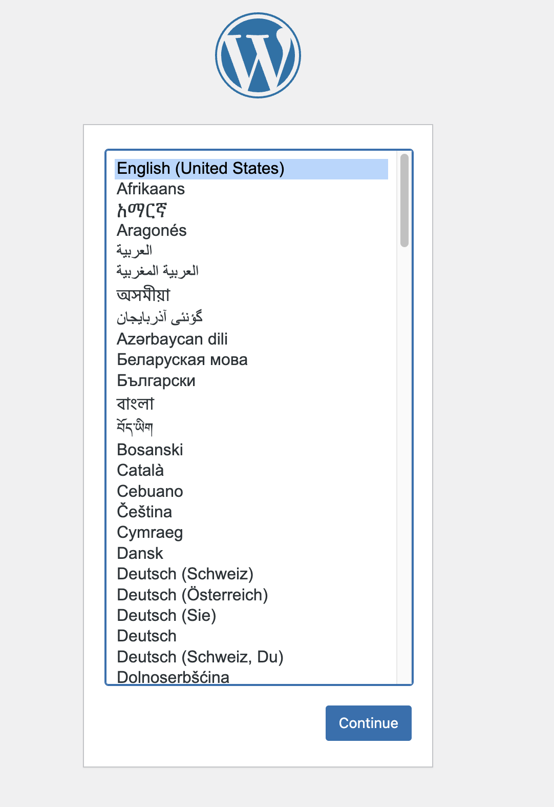
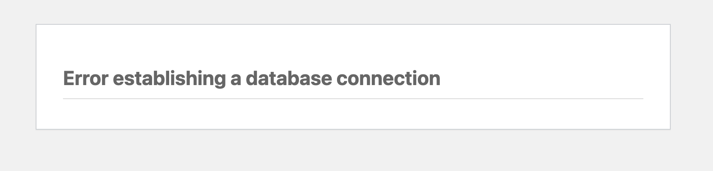
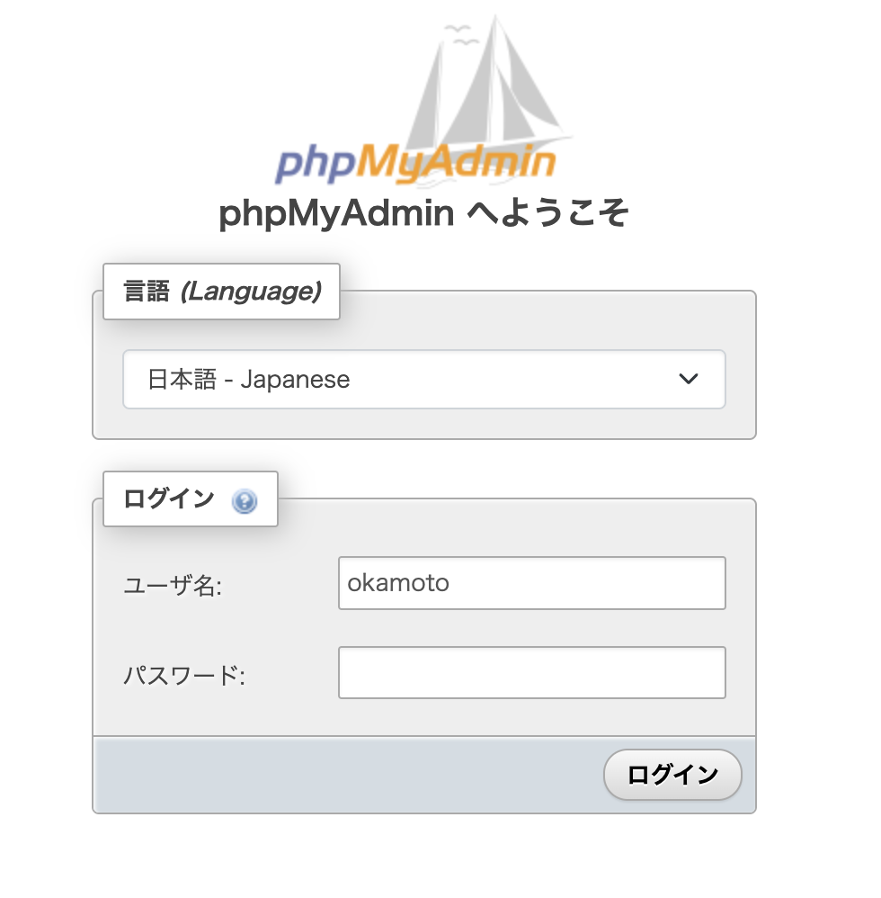

# Docker で Wordpress の開発環境を起動

## Version

- MySQL -> 8.0
- PHP -> 8.2
- WordPress -> 6.3.1

## git の管理を取り除く

このレポジトリを clone した後、以下のコマンドで git の管理を取り除く

```zsh
rm -rf .git
```

## How

### .env ファイルの作成

.env.sample を用意しているので、それをコピーして内容を変更して使用する。コマンドで作る場合は以下の通り

```bash
cp .env.sample .env
```

#### .env ファイルについて

.env で設定できるのは、以下の 4 項目

- MYSQL_ROOT_PASSWORD
- MYSQL_DATABASE
- MYSQL_USER
- MYSQL_PASSWORD

phpMyAdmin にログインする場合は、`MYSQL_USER`と`MYSQL_PASSWORD`を使用する

### docker を起動

以下のコマンドで docker を起動する

```bash
docker compose up
```

バックグラウンドで起動する場合は

```bash
docker compose up -d
```

docker の起動に成功すれば、[http://localhost:8000](http://localhost:8000) で wordpress の初期設定の画面（言語選択）が表示される。されなかったら何かがおかしい。



#### DB の接続エラー

docker の起動直後、以下のような画面が表示されることがあるが、立ち上げが終わったら初期設定の画面が表示されるので、少し待つ。



### phpMyAdmin

[http://localhost:8888](http://localhost:8888)で phpMyAdmin のページが表示される。ログインするためのユーザー名・パスワードは.env ファイルで設定したそれぞれ`MYSQL_USER`と`MYSQL_PASSWORD`を入力すればログインできる


